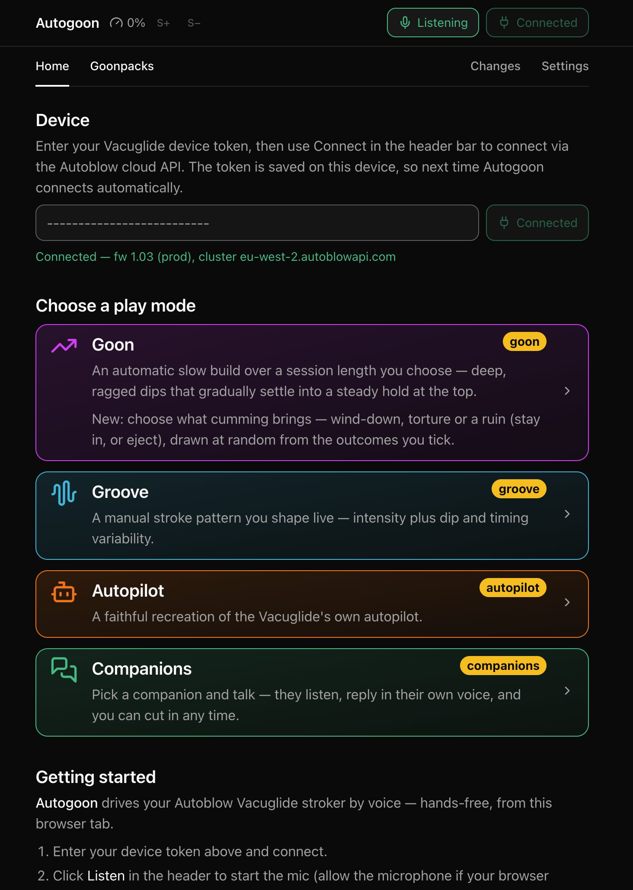

# Autogoon — voice-controlled gooning

  

Autogoon drives an Autoblow
[Vacuglide or Vacuglide 2](https://developers.autoblow.com/reference/http-api-v1-vacuglide/)
stroker from your browser, **entirely by voice**.

## For users

**▶ Try it now: [autogoon.vercel.app](https://autogoon.vercel.app/)** — nothing
to install and no wearable. Open it and enter your device token.

- **Hands-free from start to finish** — every control has a spoken word, shown
  on screen. Say it any time. Tap **Listen** once.
- **Private by default** — speech recognition runs entirely on your machine.
  [Privacy](#privacy) says what leaves it.
- **Four play modes**:
  - **[Goon](./modes/GOON.md)** — an automatic slow build over a session length
    you choose, with an intensity dial and faster/slower time-stretch.
  - **[Groove](./modes/GROOVE.md)** — a manual stroke pattern you shape live
    (intensity + dip and timing variability).
  - **[Autopilot](./modes/AUTOPILOT.md)** — a faithful recreation of Autoblow's
    own Vacuglide autopilot.
  - **[Companions](./modes/COMPANIONS.md)** — an AI companion who talks back and
    drives the toy themselves. Needs your own keys today.
- **Switch by voice** — from home, say a mode's name to enter it; say exit to
  come back and choose another, once you've stopped.

### Companions — someone to talk to

A companion has their own voice, remembers the conversation, and speaks
unprompted.

**Companions isn't usable on the public app yet.** Chat, voice and hearing are
paid cloud services. On a deploy the mode is hidden unless you have an access
ID. Run the dev server with your own keys and it's there, no ID needed.
[modes/COMPANIONS.md](./modes/COMPANIONS.md) covers setup, pictures and videos.
**Coming to the hosted app** once those services run on
[keys you enter in the app](./TODO.md#bring-your-own-api-keys) rather than the
server's.

### Goonpacks — a companion in a zip

A [goonpack](./GOONPACKS.md) is imported straight into the app. A pack carries:

- their persona;
- their voice;
- their colour;
- their own pictures and videos.

A pack is either a complete new companion or an overlay on one you already have,
adding media or swapping a voice or persona.

**A companion with a pack will send you pictures and videos.** Ask for what you
want. They search their own set, send one that fits, and never send the same one
twice in a conversation. The search reads text written when the pack was built.
Nothing is sent to a vision model mid-play.

Assembling a pack is plain-text work, no coding. [GOONPACKS.md](./GOONPACKS.md)
is the guide, with a worked example in the repo.

### Privacy

Play runs in your browser: speech recognition is local, and your packs and media
never leave your machine. What does leave it:

- **Device control** — the traffic to Autoblow's cloud API that drives the
  device.
- **Visit analytics** — the deployed app reports anonymous page views and
  performance timings to Vercel: path, referrer, coarse location, device,
  browser and load metrics. No cookies, and no content — nothing about your
  packs or your play is in it.
- **Companions** can't be local-only. During play your speech is transcribed by
  a cloud STT service, and the companion's replies come from a cloud LLM and TTS
  voice.

### Running hands-free (mobile caveats)

The Autogoon tab has to stay **foregrounded and awake**. It runs the timing loop
and the microphone continuously, and mobile browsers suspend or throttle
background or screen-locked tabs.

- **iOS Safari** — the moment the tab is backgrounded or the screen locks, the
  play mode and the mic stop. You need a **second device** dedicated to Autogoon
  (screen on, tab in front) while you use the toy. This is the only tested
  configuration.
- **iOS Chrome / Firefox / any iOS browser** _(untested)_ — expected to behave
  exactly like iOS Safari. Apple requires every iOS browser to use the system
  WebKit engine.
- **Android Chrome** _(untested)_ — a different engine, likely to keep running
  in the foreground with the screen on, but background and locked tabs are still
  throttled. A single device _may_ work if you keep the tab in front and the
  screen awake (e.g. Screen Wake Lock).

## For developers

### The app

A Next.js single-page app (App Router, TypeScript, Tailwind) with **no accounts
and no server-side database** — your device token, settings and conversations
live in your browser and nowhere else. Speech recognition is
[vosk](https://github.com/ccoreilly/vosk-browser) (WASM Kaldi) running fully
in-browser. The server side exists only for Companions:

- proxies for its chat and voice;
- a route minting a single-use token for its hearing;
- the check that validates an access ID.

They are there so the API keys never reach the client.

### Documentation

- [DEVELOPERS.md](./DEVELOPERS.md) — start here: running Autogoon locally,
  building it, and contributing.
- [ARCHITECTURE.md](./ARCHITECTURE.md) — how the app is put together.
- [MODES.md](./MODES.md) — the play modes, each with its own doc under
  [`modes/`](./modes/).

## License

[MIT](./LICENSE).
